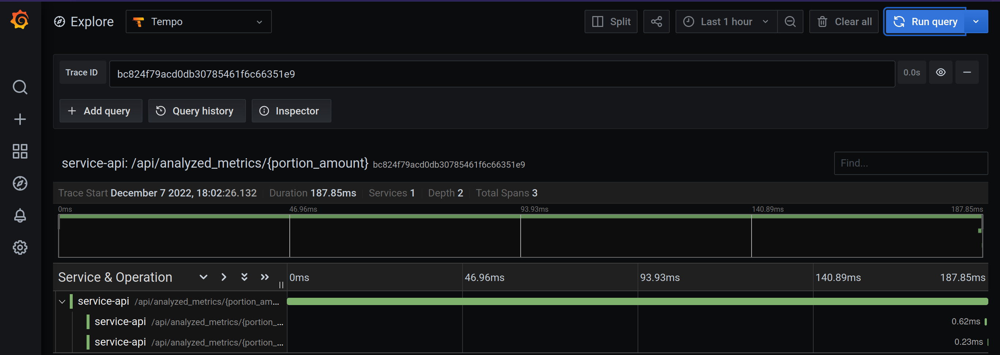
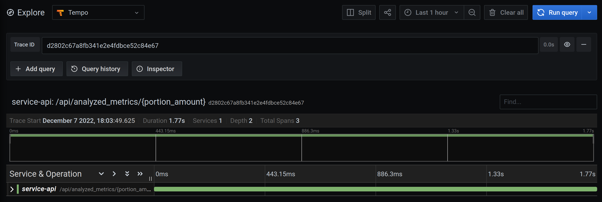

# Final diploma work of Slurm courses.

This project has the following services:
- **api** allows you to get, post raw information and get analyzed metrics;
- **metrics_generator** that generate fake metrics;
- **db** PostgreSQL
- **otel-collector** - collect trace_id
- **tempo**
- **grafana** - visualize spans

## Project technologies

- FastAPI
- Python3.10
- Aiohttp
- Flask
- PostgreSQL
- Grafana
- Tempo
- OTLP instrumentation
- Docker, docker compose

## Create **.env** file and set the <ins>following environmental variables, if you don't want to use default values</ins>:  
| Environmental       | Description                                  |
|---------------------|----------------------------------------------|
| `SECRET_KEY`        | db secret key                                |       
| `POSTGRES_USER`     | db username                                  |      
| `POSTGRES_PASSWORD` | db password                                  |
| `POSTGRES_SERVER`   | db hostname (name of docker compose service) |
| `POSTGRES_PORT`     | port for connection to db                    |
| `POSTGRES_DB`       | db table                                     |


## Running with docker compose
```bash
docker compose up -d
```

## How it works
Swagger API: http://127.0.0.1:5000/docs
1. Get analyzed metrics: http://127.0.0.1:5000/analyzed_metrics/<num>, where <num> - amount of data portion, the more, the longer request (you can see it in grafana)
2. Get **trace_id** in log in stdout
3. Paste **trace_id** in grafana http://127.0.0.1:3000/explore
4. See time of tracing network connections or/and sql queries.

For example:
http://127.0.0.1:5000/api/analyzed_metrics/1 -> 187.85ms


http://127.0.0.1:5000/api/analyzed_metrics/10 -> 1.77s


Also, it works with database queries like
http://127.0.0.1:5000/api/teams/1